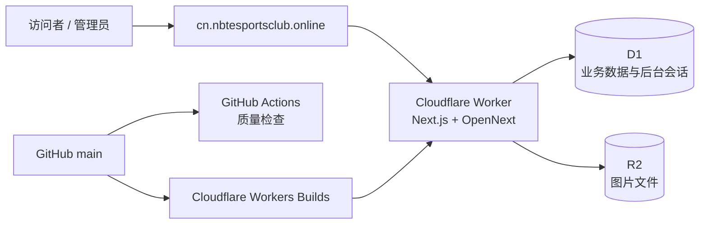

# 宁波理工电竞社官网（cs2cup）

浙大宁波理工学院电竞社的赛事与社团官网，集中展示电竞项目、赛事报名、战队、赛程、对阵、战报、动态和往届影像。

**正式站点：<https://cn.nbtesportsclub.online>**

[](https://cn.nbtesportsclub.online)

## 网站功能

### 公开站

- 浏览社团覆盖的电竞项目和历届赛事。
- 查看参赛战队、选手、赛程、淘汰赛对阵和比赛战报。
- 查看地图 Ban/Pick、单图比分和赛事结果统计。
- 在开放报名期提交战队和选手信息。
- 阅读社团动态、公告和赛事通知。
- 浏览往届赛事照片、社团成员介绍和站内搜索结果。
- 通过 [`/feed.xml`](https://cn.nbtesportsclub.online/feed.xml) 订阅最新动态。

### 管理后台

后台入口为 `/admin`，用于维护网站数据，不在仓库中保存管理员凭据。

- 审核报名信息并管理战队和选手。
- 创建赛事和电竞项目，配置规则、地图池与报名时间。
- 生成淘汰赛对阵，安排比赛时间并处理轮空晋级。
- 录入比分、胜者和地图 Ban/Pick 战报。
- 管理动态、赛事照片、社团成员和站点基本信息。

## 系统架构



| 层级 | 技术 | 职责 |
| --- | --- | --- |
| Web 应用 | Next.js 16、React 19 | 公开页面、后台页面、Server Actions 和媒体路由 |
| 运行环境 | Cloudflare Workers、OpenNext | 运行服务端渲染应用并交付静态资源 |
| 关系数据 | Cloudflare D1 | 保存赛事、战队、比赛、内容、配置、限流记录和后台会话 |
| 图片存储 | Cloudflare R2 | 保存赛事照片的二进制文件 |
| 持续集成 | GitHub Actions | 在 Pull Request 和 `main` 推送时执行类型、Lint、测试和 Worker 构建检查 |
| 持续部署 | Cloudflare Workers Builds | 从 `main` 构建并部署正式 Worker |

### 数据与安全边界

- D1 保存电竞项目、赛事、战队、选手、比赛、地图记录、动态、照片元数据、成员、站点配置、报名限流记录、管理员账号和登录会话。
- 公开页面只通过公共关系白名单查询；赛事、战队和照片等数据使用裁剪后的公开视图，待审核报名、联系方式和后台数据不会通过公开查询返回。
- R2 只保存图片文件。客户端通过 `/media/*` 读取图片，路由会先确认照片已公开或请求者具有有效管理员会话。
- 管理员密码以加盐摘要保存在 D1；登录成功后签发最长 8 小时的 `HttpOnly`、`Secure` 会话 Cookie。
- 浏览器写操作执行同源 CSRF 校验。赛事报名根据可信客户端 IP 生成 HMAC 指纹并执行频率限制，不保存原始 IP。
- 后台上传图片时会在浏览器端转为 WebP，最长边限制为 2560 像素，再写入 R2。

## 本地开发

### 前置条件

- Node.js 24
- npm 10 或更高版本
- 需要执行远端迁移或部署时，先完成 Wrangler 登录或提供具有相应权限的 API Token

### 安装并启动 Worker 预览

```powershell
npm ci
Copy-Item .env.example .env.local
npx wrangler d1 migrations apply CS2CUP_DB --local
npm run cf:preview
```

Wrangler 会在终端输出本地访问地址。如果需要测试登录、报名等写操作，请把 `.env.local` 中的 `NEXT_PUBLIC_SITE_URL` 设置为实际使用的 HTTP(S) Origin，然后重新构建预览。

## 配置

### 环境变量

| 变量 | 生产要求 | 默认值 | 用途 |
| --- | --- | --- | --- |
| `NEXT_PUBLIC_SITE_URL` | 必填 | `http://localhost:3000` | 站点的绝对 HTTP(S) Origin，用于元数据、RSS 和同源请求校验 |
| `HOME_PREVIEW_COUNTDOWN` | 可选 | 空 | 设为 `1` 时启用首页倒计时展示 |
| `REGISTRATION_FINGERPRINT_SECRET` | 必填 | 开发环境临时生成 | 生成报名限流 HMAC 指纹；生产值至少包含 32 字节 |
| `REGISTRATION_CLIENT_IP_SOURCE` | 必填 | 开发环境使用 `x-real-ip` | 可信客户端 IP 请求头；Cloudflare 生产环境使用 `cf-connecting-ip` |

不要把真实密码、Token 或生产 Secret 提交到仓库。生产 Secret 应在 Cloudflare Worker 的变量与机密设置中维护。

### Worker 绑定

绑定关系由 [`wrangler.jsonc`](./wrangler.jsonc) 声明。

| 绑定 | 资源类型 | 用途 |
| --- | --- | --- |
| `ASSETS` | 静态资源 | 交付 OpenNext 生成的前端资源 |
| `CS2CUP_DB` | D1 数据库 | 业务数据、站点配置和后台认证 |
| `CS2CUP_MEDIA` | R2 存储桶 | 赛事照片文件 |

## 数据库迁移

D1 迁移文件位于 [`cloudflare/d1/`](./cloudflare/d1/)，必须按编号顺序执行。

```powershell
# 本地数据库
npx wrangler d1 migrations apply CS2CUP_DB --local

# 远端生产数据库
npx wrangler d1 migrations apply CS2CUP_DB --remote
```

远端迁移会修改生产数据。先核对目标账号和数据库绑定，再确认 Wrangler 的迁移提示。

## 验证与构建

```powershell
# 类型检查、Lint 和全部确定性测试
npm run check

# 生成可部署的 OpenNext Worker
npm run cf:build
```

`npm run cf:build` 会先执行 Next.js 构建，再生成 `.open-next/worker.js` 和静态资源。单独运行 `npm run build` 只会生成 Next.js 构建结果，不能替代 Worker 构建。

## 部署

正式部署分支固定为 `main`。Cloudflare Workers Builds 使用以下设置：

| 设置 | 值 |
| --- | --- |
| 生产分支 | `main` |
| 根目录 | `/` |
| 构建命令 | `npm run cf:build` |
| 部署命令 | `npx @opennextjs/cloudflare deploy` |

需要手动部署当前检出版本时执行：

```powershell
npm run cf:build
npx @opennextjs/cloudflare deploy
```

涉及 D1 Schema 变更时，先执行远端迁移，再部署依赖新结构的 Worker。

## 项目结构

| 路径 | 职责 |
| --- | --- |
| [`app/`](./app/) | Next.js 公开站、管理后台、媒体路由和页面元数据 |
| [`lib/`](./lib/) | 数据查询、认证、存储、赛程、对阵、限流和安全边界 |
| [`cloudflare/d1/`](./cloudflare/d1/) | D1 Schema、初始站点配置和后台认证迁移 |
| [`scripts/`](./scripts/) | 确定性测试、可访问性、键盘操作和性能检查脚本 |
| [`wrangler.jsonc`](./wrangler.jsonc) | Worker 入口、兼容性、静态资源、D1 和 R2 绑定 |

## 常见问题

### 页面提示 D1 或 R2 未配置

检查 `wrangler.jsonc` 中是否存在 `CS2CUP_DB` 和 `CS2CUP_MEDIA` 绑定，并确认本地或远端 D1 迁移已经执行。

### 登录或报名写操作被拒绝

确认 `NEXT_PUBLIC_SITE_URL` 与浏览器实际 Origin 完全一致。生产环境还必须配置足够长度的 `REGISTRATION_FINGERPRINT_SECRET`，并把 `REGISTRATION_CLIENT_IP_SOURCE` 设为 `cf-connecting-ip`。

### Worker 部署时找不到入口文件

确认构建命令是 `npm run cf:build`。`wrangler.jsonc` 指向的入口是 `.open-next/worker.js`，它不会由普通的 `npm run build` 生成。

### R2 中存在图片但网站返回 404

图片文件和 D1 中的照片元数据必须同时存在，且所属赛事需要处于公开状态。未发布的图片只允许已登录管理员读取。
