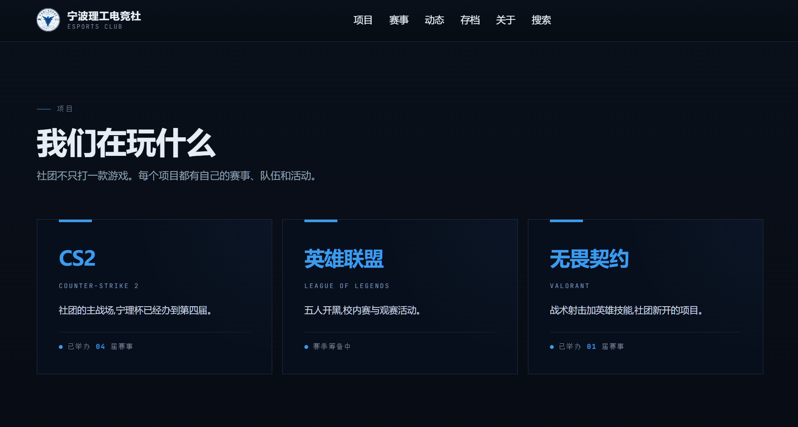

# CS2 Cup

Tournament and club website for the NingboTech Esports Club.

Production: <https://cn.nbtesportsclub.online>

[](https://cn.nbtesportsclub.online)

## Stack

- Next.js 16 and React 19
- Cloudflare Workers through OpenNext
- Cloudflare D1 for relational data and sessions
- Cloudflare R2 for tournament media
- GitHub Actions for quality checks and builds

## Requirements

- Node.js 24
- npm 11
- Wrangler authentication for remote migrations and deployment

## Local development

```sh
npm ci
cp .env.example .env.local
npx wrangler d1 migrations apply CS2CUP_DB --local
npm run cf:preview
```

Set `NEXT_PUBLIC_SITE_URL` to the preview origin before testing authenticated or write flows.

## Configuration

| Variable                          | Production | Purpose                                                        |
| --------------------------------- | ---------- | -------------------------------------------------------------- |
| `NEXT_PUBLIC_SITE_URL`            | Required   | Canonical HTTP(S) origin                                       |
| `HOME_PREVIEW_COUNTDOWN`          | Optional   | Enables the homepage countdown preview                         |
| `REGISTRATION_FINGERPRINT_SECRET` | Required   | HMAC secret with at least 32 bytes                             |
| `REGISTRATION_CLIENT_IP_SOURCE`   | Required   | Trusted client IP header; use `cf-connecting-ip` on Cloudflare |

Bindings are declared in [`wrangler.jsonc`](./wrangler.jsonc):

- `CS2CUP_DB`: D1 database
- `CS2CUP_MEDIA`: R2 bucket
- `ASSETS`: OpenNext static assets

Never commit credentials or production secrets.

## Database migrations

Migrations live in [`cloudflare/d1`](./cloudflare/d1) and must run in numeric order.

```sh
npx wrangler d1 migrations apply CS2CUP_DB --local
npx wrangler d1 migrations apply CS2CUP_DB --remote
```

Verify the account and database binding before applying remote migrations.

## Quality

```sh
npm run format
npm run check
npm run cf:build
```

`npm run check` is the single local and CI quality entry point. It checks formatting, types,
ESLint, deterministic tests, and source-size limits. Source files are limited to 300 non-empty
lines.

Repository documentation, configuration, comments, identifiers, and file names use English.
User-facing copy may use Chinese.

## Deployment

Build and deploy from `main`:

```sh
npm run cf:build
npx @opennextjs/cloudflare deploy
```

Apply remote D1 migrations before deploying code that depends on a new schema.

## Structure

| Path                                                             | Responsibility                                                        |
| ---------------------------------------------------------------- | --------------------------------------------------------------------- |
| [`app`](./app)                                                   | Public routes, admin routes, metadata, and media delivery             |
| [`app/admin/(console)/actions`](<./app/admin/(console)/actions>) | Domain-scoped admin Server Actions                                    |
| [`components`](./components)                                     | UI, layout, and domain components                                     |
| [`lib/queries`](./lib/queries)                                   | Public and authenticated data access                                  |
| [`lib`](./lib)                                                   | Authentication, storage, scheduling, seeding, and shared domain logic |
| [`cloudflare/d1`](./cloudflare/d1)                               | D1 schema and migrations                                              |
| [`scripts`](./scripts)                                           | Deterministic, accessibility, keyboard, and performance checks        |
